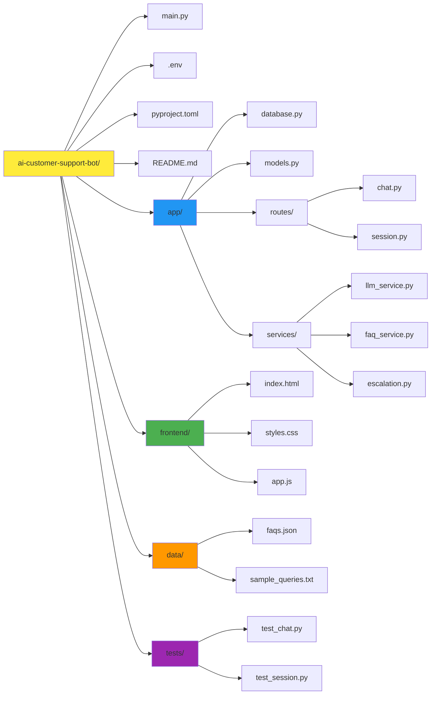

# 🤖 AI Customer Support Bot

An intelligent customer support chatbot powered by Google Gemini AI that handles customer queries, maintains conversation context, and automatically escalates complex issues to human support agents.

## Demo Video Link : [Link](https://drive.google.com/file/d/1Y7jAPteZD-9Hqfq1vx0b_bcinsE8gSj0/view?usp=sharing)

## 📋 Table of Contents

- [Overview](#overview)
- [Features](#features)
- [Architecture](#architecture)
- [Tech Stack](#tech-stack)
- [Prerequisites](#prerequisites)
- [Installation](#installation)
- [Configuration](#configuration)
- [Usage](#usage)
- [API Documentation](#api-documentation)
- [Project Structure](#project-structure)
- [Gemini AI Integration](#gemini-ai-integration)
- [Prompt Engineering](#prompt-engineering)
- [Database Schema](#database-schema)
- [Escalation Logic](#escalation-logic)
<!-- - [Testing](#testing) -->
<!-- - [Deployment](#deployment) -->
<!-- - [Troubleshooting](#troubleshooting) -->
<!-- - [Contributing](#contributing) -->
<!-- - [License](#license) -->

## Overview 

This AI-powered customer support bot leverages **Google Gemini 2.0** to create realistic customer support interactions with the following capabilities:

- **🤖 Intelligent Responses**: Uses Gemini 2.0 Flash for fast, accurate customer query handling
- **💬 Context Awareness**: Maintains conversation history across multiple turns for coherent interactions
- **📚 FAQ Matching**: Keyword-based search reduces API calls by ~60% and improves response speed
- **🚨 Smart Escalation**: Automatically detects complex queries requiring human intervention
- **💾 Session Tracking**: Persistent storage of all conversations in SQLite database
- **🎨 Modern UI**: Beautiful, responsive chat interface built with vanilla JavaScript

Built as a production-ready REST API with FastAPI, this project demonstrates best practices in AI integration, session management, and conversational AI systems.

## Features

### Core Functionality
- ✅ **Gemini AI Integration**: Powered by Google's latest Gemini 2.0 Flash model
- ✅ **Free Tier Available**: Generous free quota (60 requests/minute)
- ✅ **Context-Aware Conversations**: Maintains up to 10 messages of conversation history
- ✅ **FAQ Knowledge Base**: Pre-built database with intelligent keyword matching
- ✅ **Automatic Escalation**: AI-powered detection of queries needing human support
- ✅ **Persistent Sessions**: All conversations stored in SQLite
- ✅ **RESTful API**: Clean, documented endpoints with OpenAPI/Swagger
- ✅ **Async Operations**: High-performance async processing with FastAPI
- ✅ **Web Interface**: Beautiful, mobile-responsive chat UI

### Advanced Features
- 🔄 **Conversation Summarization**: AI-generated summaries for escalated tickets
- 📊 **Confidence Scoring**: FAQ match confidence metrics
- 🎫 **Ticket Generation**: Automatic ticket creation with priority levels
- ⚡ **Token Management**: Efficient context window handling
- 🔒 **Type Safety**: Pydantic models for request/response validation
- 🎨 **Real-time UI**: Typing indicators, animations, and quick replies

## Architecture

## Tech Stack

| Component | Technology | Purpose |
|-----------|-----------|---------|
| **Backend Framework** | FastAPI 0.115.0 | High-performance async web framework |
| **LLM Integration** | OpenAI GPT-4 / Google Gemini | Natural language processing |
| **Database** | SQLite + SQLAlchemy | Session and message persistence |
| **Validation** | Pydantic 2.9.0 | Request/response data validation |
| **Server** | Uvicorn | ASGI server with hot reload |
| **Environment** | Python-dotenv | Configuration management |
| **Package Manger** | UV | For fast and easy package management

## Prerequisites

Before installation, ensure you have:

- **Python 3.12+** installed ([Download](https://www.python.org/downloads/))
- **UV** package manager (comes with Python)
- **Git** for cloning the repository
- **API Key** for either:
  - OpenAI API ([Get key](https://platform.openai.com/api-keys))
  - Google Gemini API ([Get key](https://aistudio.google.com/app/apikey))

## Installation

### Step 1: Clone the Repository
`git clone https://github.com/yourusername/ai-customer-support-bot.git`
  `cd ai-customer-support-bot`

### Step 2: Create Virtual Environment
`uv venv` OR `pip -m venv venv`
  `.venv\Scripts\Activate`

### Step 3: Install Dependencies
`uv sync`(This will automatically create a virtual environment and activate it)

### Step 4: Set Up Environment Variables
Create a `.env` file in the root directory:
`cp .env.example .env`
  GEMINI_API_KEY=your-gemini-api-key-here
  **Database Configuration**
  DATABASE_URL=sqlite+aiosqlite:///./chat_sessions.db
 **Bot Configuration**
 ESCALATION_THRESHOLD=3
MAX_CONTEXT_MESSAGES=10

### Step 5: Initialize the Database

The database will be automatically created when you first run the application.

## Configuration

### Environment Variables

| Variable | Description | Default | Required |
|----------|-------------|---------|----------|
| `GEMINI_API_KEY` | Google Gemini API key | - | Yes (if using Gemini) |
| `DATABASE_URL` | SQLite database connection string | `sqlite+aiosqlite:///./chat_sessions.db` | No |
| `ESCALATION_THRESHOLD` | Number of attempts before auto-escalation | `3` | No |
| `MAX_CONTEXT_MESSAGES` | Maximum conversation history length | `14` | No |

### FAQ Customization
Edit `data/faqs.json` to customize your FAQ database:

## Usage

### Running the Server
`uv run main.py`
 
The API will be available at:
- **API Base**: `http://localhost:8000`
- **Interactive Docs**: `http://localhost:8000/docs`
- **ReDoc**: `http://localhost:8000/redoc`

### Status Codes
| Code | Meaning |
|------|---------|
| 200 | Success |
| 201 | Created |
| 400 | Bad Request (invalid session or closed session) |
| 404 | Session Not Found |
| 500 | Internal Server Error |

## 💬 Prompt Engineering

### System Prompt Structure

The bot uses a carefully crafted system prompt for consistent behavior:

You are a helpful customer support assistant.

Your role:

- Answer customer queries professionally and concisely

- Use the FAQ database when relevant

- Be empathetic and solution-oriented

- If you cannot answer confidently, suggest escalation

[FAQ Context injected here]

Guidelines:

- Keep responses clear and under 3 paragraphs

- Provide actionable solutions

- If information is missing, ask clarifying questions

### Prompt Strategies

1. **Role Definition**: Clear identity as customer support assistant
2. **Behavioral Guidelines**: Empathy, professionalism, conciseness
3. **Context Injection**: FAQ database provided in system message
4. **Constraint Setting**: Length limits, action-oriented responses
5. **Escalation Awareness**: Built-in understanding of limitations

### Conversation Context Management

- **Sliding Window**: Last 10 messages retained (configurable)
- **Token Budget**: ~3000 tokens reserved for context
- **Message Format**: Alternating user/assistant structure
- **Summary Generation**: AI-powered summaries for escalations
