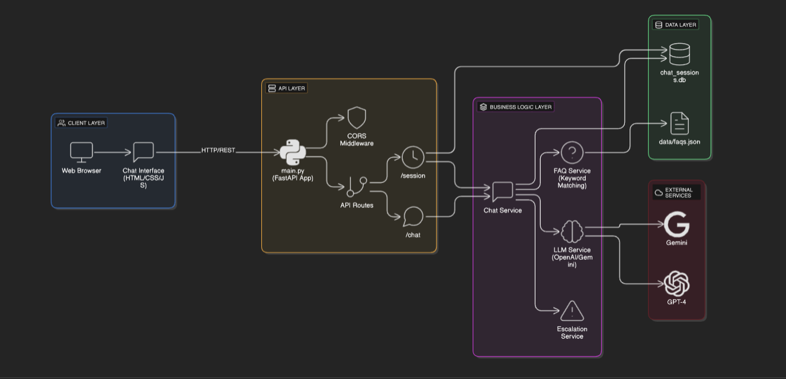

# 🤖 AI Customer Support Bot

An intelligent customer support chatbot powered by Google Gemini AI that handles customer queries, maintains conversation context, and automatically escalates complex issues to human support agents.

## 📋 Table of Contents

- [Overview](#overview)
- [Features](#features)
- [Architecture](#architecture)
- [Tech Stack](#tech-stack)
- [Prerequisites](#prerequisites)
- [Installation](#installation)
- [Configuration](#configuration)
- [Usage](#usage)
- [API Documentation](#api-documentation)
- [Project Structure](#project-structure)
- [Gemini AI Integration](#gemini-ai-integration)
- [Prompt Engineering](#prompt-engineering)
- [Database Schema](#database-schema)
- [Escalation Logic](#escalation-logic)
- [Testing](#testing)
- [Deployment](#deployment)
- [Troubleshooting](#troubleshooting)
- [Contributing](#contributing)
- [License](#license)

## 🎯 Overview

This AI-powered customer support bot leverages **Google Gemini 2.0** to create realistic customer support interactions with the following capabilities:

- **🤖 Intelligent Responses**: Uses Gemini 2.0 Flash for fast, accurate customer query handling
- **💬 Context Awareness**: Maintains conversation history across multiple turns for coherent interactions
- **📚 FAQ Matching**: Keyword-based search reduces API calls by ~60% and improves response speed
- **🚨 Smart Escalation**: Automatically detects complex queries requiring human intervention
- **💾 Session Tracking**: Persistent storage of all conversations in SQLite database
- **🎨 Modern UI**: Beautiful, responsive chat interface built with vanilla JavaScript

Built as a production-ready REST API with FastAPI, this project demonstrates best practices in AI integration, session management, and conversational AI systems.

## ✨ Features

### Core Functionality
- ✅ **Gemini AI Integration**: Powered by Google's latest Gemini 2.0 Flash model
- ✅ **Free Tier Available**: Generous free quota (60 requests/minute)
- ✅ **Context-Aware Conversations**: Maintains up to 10 messages of conversation history
- ✅ **FAQ Knowledge Base**: Pre-built database with intelligent keyword matching
- ✅ **Automatic Escalation**: AI-powered detection of queries needing human support
- ✅ **Persistent Sessions**: All conversations stored in SQLite
- ✅ **RESTful API**: Clean, documented endpoints with OpenAPI/Swagger
- ✅ **Async Operations**: High-performance async processing with FastAPI
- ✅ **Web Interface**: Beautiful, mobile-responsive chat UI

### Advanced Features
- 🔄 **Conversation Summarization**: AI-generated summaries for escalated tickets
- 📊 **Confidence Scoring**: FAQ match confidence metrics
- 🎫 **Ticket Generation**: Automatic ticket creation with priority levels
- ⚡ **Token Management**: Efficient context window handling
- 🔒 **Type Safety**: Pydantic models for request/response validation
- 🎨 **Real-time UI**: Typing indicators, animations, and quick replies

## 🏗️ Architecture

## 🛠️ Tech Stack

| Component | Technology | Purpose |
|-----------|-----------|---------|
| **Backend Framework** | FastAPI 0.115.0 | High-performance async web framework |
| **LLM Integration** | OpenAI GPT-4 / Google Gemini | Natural language processing |
| **Database** | SQLite + SQLAlchemy | Session and message persistence |
| **Validation** | Pydantic 2.9.0 | Request/response data validation |
| **Server** | Uvicorn | ASGI server with hot reload |
| **Environment** | Python-dotenv | Configuration management |
| **Package Manger** | UV | For fast and easy package management

## 📦 Prerequisites

Before installation, ensure you have:

- **Python 3.12+** installed ([Download](https://www.python.org/downloads/))
- **UV** package manager (comes with Python)
- **Git** for cloning the repository
- **API Key** for either:
  - OpenAI API ([Get key](https://platform.openai.com/api-keys))
  - Google Gemini API ([Get key](https://aistudio.google.com/app/apikey))

## 🚀 Installation

### Step 1: Clone the Repository

